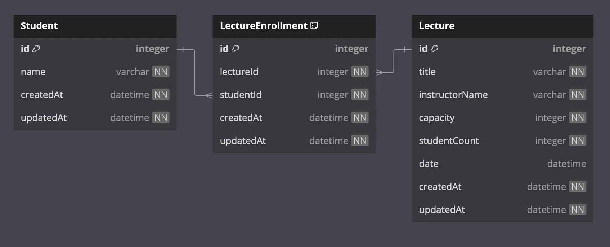

# 테이블 및 ERD 설계 보고서

## 개요

특강 신청과 특강 신청 목록을 조회할 수 있는 애플리케이션을 구축하기 위해,
해당 서비스에 필요한 테이블을 고민해보고 각 테이블의 필드와 테이블 간의 연관관계는 어떻게 구성할 지 설계합니다.

## ERD

제가 구성한 ERD는 다음과 같습니다.

## 테이블 설명 및 설계 이유

### Student 테이블

- 특강을 신청할 수 있는 학생 정보에 대한
    - name : 학생 이름

### Lecture 테이블

- 강의 정보에 대한 테이블
    - title : 강의명
    - instructorName : 강사명
    - capacity : 수용인원
    - studentCount : 현재 신청 인원
    - date : 강의 날짜

### LectureEnrollment 테이블

- 강의를 신청한 학생을 담는 중간 테이블
    - lectureId : 강의 id
    - studentId : 학생 id

### 연관관계

- 논리적 연관관계
    - Student > LectureEnrollment : N:1 연관관계
    - LectureEnrollment < Lecture : 1:N 연관관계

### 비정규화

- Lecture 테이블에 해당 특강을 현재 신청한 인원인 studentCount를 비정규화하여 필드로 추가
    - 해당 값이 비정규화 되어있지 않다면, 특강 신청 가능 목록 조회 시 조회 되는 특강 개수만큼 LectureEnrollment에 count 쿼리를 수행해야하기 때문에 비정규화하여 필드로 추가
    - Lecture 테이블을 수정할 때 비관적 락(쓰기 락)을 통해 동시에 수정하는 것을 막아 studentCount의 정합성을 유지

### 동시성 제어 방식

- 동시성 제어 API : 강의 신청 API
    - 강의 신청 시 신청하려는 강의(Lecture) 레코드에 쓰기 락을 걸어서 수정이 발생하는 트랜잭션 내에서 유지하도록 구현
    - 성능이 조금 저하되더라도 트랜잭션 시작과 동시에 락을 얻어 선착순에 대한 순서 보장

## 결론

### 느낀점

초반 설계를 잘해두는 것이 개발 전체에 엄청 큰 영향을 미치고, 그만큼 중요하다는 것을 알게 되었습니다.

### 부족했던 점

시간이 부족하여 필수적인 요소들만 테스트를 작성하였는데,
조금 더 세분화해서 테스트 해볼 수 있지 않았을까하는 생각이 들었습니다.